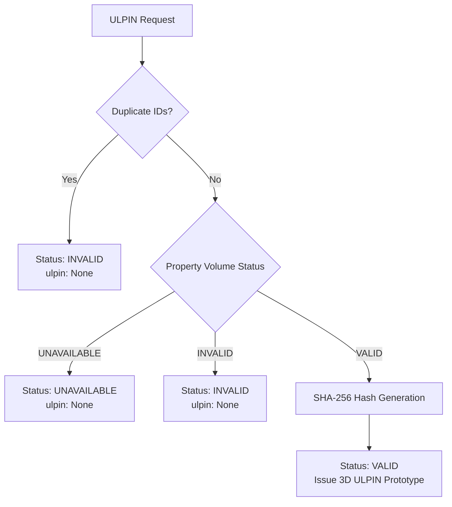

# 3D ULPIN Prototype Specification (v1.0)

> [!IMPORTANT]
> **CRITICAL SEMANTIC NOTICE & SCOPE BOUNDARY**  
> **3D ULPIN Prototype** is a **project-specific, deterministic identifier design** created for the STHARA prototype.  
> It is **NOT** an official Government of India ULPIN (Unique Land Parcel Identification Number) specification.  
> When an authoritative national or state-level 3D cadastral specification becomes available, this prototype design can be cleanly mapped or adapted without disrupting underlying cadastral spatial relationships.

---

## 1. Purpose & Objective

As cadastral systems evolve from 2D planar land parcels to vertically stratified, multi-level property units (apartments, commercial suites, air rights, underground spaces), each distinct property unit requires a unique, stable, and reproducible spatial identifier:

$$\text{PARCEL} \longrightarrow \text{BUILDING} \longrightarrow \text{FLOOR} \longrightarrow \text{PROPERTY\_VOLUME} \longrightarrow \text{3D ULPIN}$$

The objective of the **3D ULPIN Prototype** is to provide an immutable, cryptographically verifiable identifier for a validated 3D property entity that satisfies:
- **Strict Determinism**: Re-evaluating the same cadastral entity always yields the identical identifier.
- **Rendering & Geometry Independence**: The identifier does not change when the 3D mesh is re-tessellated, rotated, or reordered.
- **Provenance Transparency**: The identifier is directly traceable to its constituent cadastral components.
- **Explicit Versioning**: Coexists cleanly with future algorithm iterations.

---

## 2. Property Entity vs. Mesh Geometry Separation

A core architectural principle of this system is the strict separation between the **property entity** and its **mesh geometry**:

```text
PROPERTY ENTITY
    │
    ├── property_id      (cadastral identifier)
    ├── parcel_id        (parent land parcel)
    ├── building_ids     (sorted parent structure IDs)
    └── floor_ids        (sorted vertical floor level IDs)
          │
          ▼
PROPERTY_VOLUME (Spatial solid extent)
    │
    ├── Mesh3DCollection (2-manifold closed solids)
    ├── volume_cubic_m   (continuous metric volume)
    ├── bounds           (spatial bounding envelope)
    └── geometry_status  (VALID / INVALID / UNAVAILABLE)
          │
          ▼
3D ULPIN PROTOTYPE (Entity identifier)
    │
    └── 3DULPIN-V1-<SHA256_HEX_DIGEST>
```

### Why Raw Geometry is NOT Hashed

$$\text{3D ULPIN} \neq \text{hash}(\text{raw vertices})$$

1. **Floating-Point Instability**: Numerical floating-point coordinates across different hardware, CRS re-projections, or rounding modes will introduce microscopic differences ($10^{-9}\text{ m}$) that alter cryptographic hashes without changing the real-world property.
2. **Mesh Serialization & Three.js Artifacts**: Triangle face indices, vertex array ordering, and scene graph transformations vary across frontend rendering engines (e.g., Three.js vs Cesium vs BabylonJS). An entity identifier must never depend on graphics pipeline state.
3. **Property Identity Invariance**: A property unit maintains its cadastral identity regardless of whether it is visualized as a simplified low-poly bounding box, a photorealistic architectural mesh, or a wireframe schematic.

---

## 3. Canonical Identity Payload

The canonical identity payload contains only stable, normalized cadastral entity fields:

| Field | Type | Description | Invariant Rule |
| :--- | :--- | :--- | :--- |
| `namespace` | string | Identifier namespace | Fixed to `"3DULPIN"` |
| `version` | string | Algorithm version | Fixed to `"1"` |
| `property_id` | string | Unique property entity ID | Trimmed, non-empty string |
| `parcel_id` | string | Parent land parcel ID | Trimmed, non-empty string |
| `building_ids`| list[str] | Constituent building IDs | Unique, lexicographically sorted |
| `floor_ids` | list[str] | Constituent floor IDs | Unique, lexicographically sorted |
| `source_identity` | string | Cadastral provenance | `"cadastral_spatial_record"` |

---

## 4. Canonical Serialization

To guarantee consistent hashing across diverse programming languages and platforms, the payload is serialized into a single delimited canonical string:

```text
3DULPIN|v1|property:<property_id>|parcel:<parcel_id>|buildings:<bld1>,<bld2>|floors:<fl1>,<fl2>
```

### Invariants:
1. **Sorted Components**: Building IDs and floor IDs are sorted lexicographically before serialization:
   - `["BLD-002", "BLD-001"]` $\longrightarrow$ `"buildings:BLD-001,BLD-002"`
   - `["FL-03", "FL-01", "FL-02"]` $\longrightarrow$ `"floors:FL-01,FL-02,FL-03"`
2. **Deterministic String**: No arbitrary whitespace, standard ASCII delimiters (`|`, `:`, `,`).
3. **Explicit Encoding**: Explicitly encoded as UTF-8 bytes prior to cryptographic hashing.

---

## 5. Hash Generation & Format

The serialized canonical string is hashed using cryptographic SHA-256 (standard Python `hashlib`):

$$\text{digest} = \text{SHA-256}(\text{canonical\_identity}_{\text{UTF-8}})$$

The resulting 64-character uppercase hexadecimal digest is formatted into the versioned identifier:

```text
3DULPIN-V1-<64_HEX_DIGEST>
```

### Example:
For property `PROP-DEMO-101-U01` on parcel `PARCEL-DEMO-101`, building `BLD-DEMO-001`, and floor `BLD-DEMO-001-FL00`:
- **Canonical String**:
  ```text
  3DULPIN|v1|property:PROP-DEMO-101-U01|parcel:PARCEL-DEMO-101|buildings:BLD-DEMO-001|floors:BLD-DEMO-001-FL00
  ```
- **Generated 3D ULPIN Prototype**:
  ```text
  3DULPIN-V1-84858AEA396AF0DC75907857A1A138D6247900F164ECAB9565CA7F3BDFB2CDD8
  ```

---

## 5.1 Canonical 3D ULPIN vs. Property Record Reference

To preserve complete semantic clarity and prevent confusion during platform evaluations, the system strictly separates the **cryptographic spatial identifier** from the **human-readable presentation reference**:

| Characteristic | Canonical 3D ULPIN Prototype | Property Record Reference |
| :--- | :--- | :--- |
| **Field Name** | `ulpin_prototype` / `canonical_ulpin` | `property_record_reference` / `canonical_path` |
| **Format** | `3DULPIN-V1-<64_HEX_SHA256_DIGEST>` | `P001-B01-FL05-U501` or `P001/B01/05/501` |
| **Generation** | `ULPINService.generate_3d_ulpin()` / `generate_for_unit()` | String interpolation of presentation aliases |
| **Purpose** | Deterministic, immutable, cryptographically verifiable spatial identifier | Human-readable strata hierarchy navigation |
| **Verifiable** | **YES** (via `POST /api/v1/ulpin/verify`) | **NO** (rejected as non-hash by verification service) |
| **UI Badge** | `DETERMINISTIC HASH` | `Property Record Reference` |

### Unit-Level Delegation Rule:
Units/apartments are first-class strata property entities. In `UnitService.create_property_record()`, the system maps the unit to its canonical property payload (`property_id`, `parcel_id`, `building_id`, `floor_id`) and delegates exclusively to `ULPINService.generate_for_unit()`. No duplicate hashing algorithms or pseudo-hashes exist in the codebase.

### Strict Exclusion of Raw Geometry:
The canonical identity hash explicitly **excludes** 3D centroids, bounding cubes, mesh vertices, surface areas, and continuous volumes. Hashing raw floating-point metrics introduces rounding and platform-dependent discrepancies. The ULPIN remains strictly stable across any visual representation (mesh, wireframe, low-poly, or BIM).

---

## 6. Preconditions & Spatial Validation

A valid 3D ULPIN is issued **only when the spatial property volume is verified**:



1. **Duplicate Rejection**: Duplicate building or floor references (e.g. `[BLD-01, BLD-01]`) indicate upstream corruption and result in `identifier_status = INVALID`.
2. **Spatial Geometry Verification**: If the underlying `PROPERTY_VOLUME` has `geometry_status = UNAVAILABLE`, the system issues `identifier_status = UNAVAILABLE`. A valid identifier cannot be issued for an unverified or incomplete spatial volume.

---

## 7. API Reference

| Endpoint | Method | Description |
| :--- | :--- | :--- |
| `/api/v1/properties/generate-ulpin` | `POST` | Generates a 3D ULPIN prototype for a single property entity. |
| `/api/v1/properties/verify-ulpin` | `POST` | Recomputes the canonical hash and verifies a supplied 3D ULPIN. |
| `/api/v1/properties/demo-ulpins` | `GET` | Returns precomputed 3D ULPIN prototypes for all demo properties. |
| `/api/v1/ulpin/generate` | `POST` | Core domain endpoint for 3D ULPIN generation. |
| `/api/v1/ulpin/verify` | `POST` | Core domain endpoint for 3D ULPIN verification. |
| `/api/v1/ulpin/batch` | `POST` | Processes multiple property entities in a single batch request. |

---

## 8. Verification & Test Suite

The deterministic behavior is verified by 15 dedicated test cases in `backend/tests/test_3d_ulpin.py`:
- `test_ulpin_same_property_same_identifier`
- `test_ulpin_different_properties_different_identifiers`
- `test_ulpin_building_ordering_independence`
- `test_ulpin_floor_ordering_independence`
- `test_ulpin_independent_of_raw_geometry`
- `test_ulpin_property_identity_change_alters_ulpin`
- `test_ulpin_version_change_alters_ulpin`
- `test_ulpin_rejects_duplicate_buildings_or_floors`
- `test_ulpin_unavailable_spatial_volume_yields_unavailable_status`
- `test_ulpin_invalid_spatial_volume_yields_invalid_status`
- `test_ulpin_verification_success_and_tamper_detection`
- `test_api_generate_ulpin`
- `test_api_verify_ulpin`
- `test_api_get_demo_ulpins`
- `test_api_ulpin_router`
